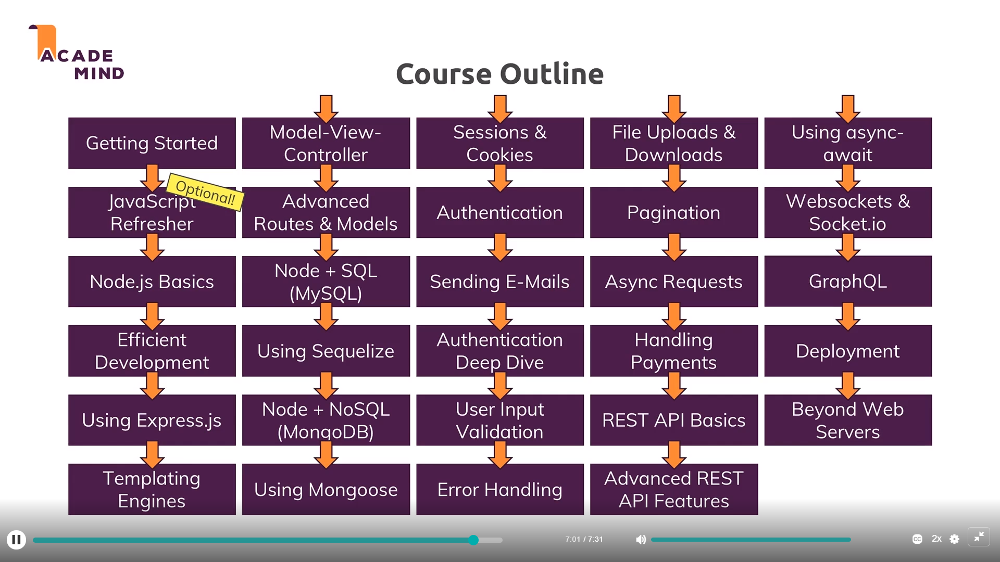

# NodeJS -> JavaScript On the Server

Server Side Technology need:

* Database Accessing
* Authentication
* Input Validation
* Business logic
* Utility Scripts


Node JS Role:

* **RUN SERVER**
  * Create Server and Listen to incoming requests
* **BUSINESS LOGIC**
  * Handle requests, Validate Input, Connect to Database
* **RESPONSES**
  * Return Responses (Rendered HTML, JSON)





## JavaScript

```javascript
//Basics
const name = 'Adi';
let age = 25;
const hasHobbies = true;

//Below way of making functions & tradional way has a difference,that is in this keyword
const summarizeUser = (userName, userAge, userHasHobby) => {
    return (
    	'Name is '+
        username +
        ', age is ' +
        userAge + 
        ' and user has hobbies : ' +
        userHasHobby
    );
}

console.log(summarizeUser(name, age, hasHobbies));

//Objects
const person = {
    name: 'Adi',
    age: 25,
    //Won't work
    //greet: () => {
    //    console.log('I am ' + this.name)
    //}
    greet: function(){
        console.log('I am ' + this.name)
    }
};

const printName = ({ name }) => {
    console.log(name);
}
printName(person);

const { name, age } = person;
console.log(name, age);

//Arrays
const hobbies = [
    'Sports',
    'Cooking'
];

for(let hobby of hobbies){
    console.log(hobby)
}

//To make an operation on array elements
hobbies.map(hobby => {
    return 'Hobby: ' + hobby
});

const copiedArray = [...hobbies]; //This thing works for Objects also
const [hobby1, hobby2] = hobbies;

//Rest Operator
const toArray = (...args) => {
    return args;
}

//Promises
//Asynchronous code => Allows next instructions to execute and doesnt wait for current
//Once the async condition is matched, its instruction gets executed.
//The instruction to be executed on matching condition can be implemented by:
//CALLBACK FUNCTION
	setTimeout(() => {
		console.log("Timer is done");
	}, 2000)
//PROMISES
	const fetchData = () => {
		const promise = new Promise((resolve, reject) => {
			setTimeout(() => {
				resolve("Done");
			}, 2000)
		});
		return promise;
	}
	fetchData.then(text => {
		console.log(text);
	})

```


## NodeJS

Core Modules:

* http -----------> Launch a server, send requests
* https --------------> Launch a SSL server
* fs
* path
* os


**BASICS**

```javascript
const http = require('http');

const server = http.createServer((req, res) => {
    console.log(req.url, req.method, req.headers);
    res.setHeader('Content-Type','text/html');
    res.write('<html>');
    res.write('<head><title>My First Page</title></head>');
    res.write('<body><h1>Hello</h1></body>');
    res.write('</html>');
    res.end();
});

//Event loop is server keeps on running (receiving requests) as long as there are event listeners registered. We terminate by process.exit()
server.listen(3000);


```

**ADVANCED**

```javascript
const http = require('http');
const fs = require('fs');

const server = http.createServer((req,res) => {
	const url = req.url;
    const method = req.method;
    
	if(url === '/'){
        res.write('<html>');
        res.write('<head><title>Enter Message</title></head>');
        res.write('<body><form action="/message" method="POST"><input type="text" name="message"><button type="submit">Submit</button></form></body>')
        res.write('</html>');
        return res.end();
    }
    
    if(url === '/message' && method === 'POST'){
        fs.writeFileSync('message.txt', 'DUMMY');
        res.statusCode = 302;
        res.sendHeader('Location', '/');
        return res.end();
    }
})

server.listen(3000);
```

